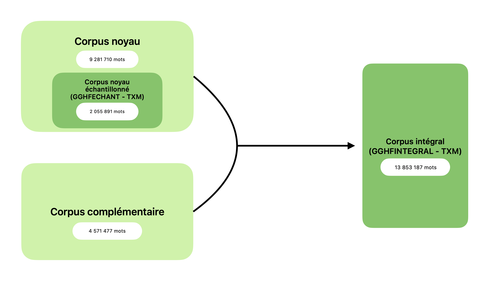

# Présentation du corpus GGHF

Le corpus GGHF (corpus de la Grande Grammaire Historique du Français) est un corpus de plus de 13 millions de mots qui couvre la période du 9e au 20e siècle. Les textes qui le composent appartiennent à différents domaines et genres, à des dialectes variés et sont écrits en vers et/ou en prose. 

## Présentation générale

Le corpus GGHF a été constitué dans le cadre du projet éditorial de la Grande Grammaire Historique du Français, parue en 2020 et co-éditée par C. Marchello-Nizia, B. Combettes, S. Prévost et T. Scheer (De Gruyter Mouton). 

L’objectif était d’obtenir un corpus aussi représentatif et équilibré que possible de la langue française, de ses origines à la fin du 20e siècle, dans toute la diversité qu’on lui présuppose, tout en constituant un corpus qui reste maniable, tant du point de vue de l’exploration des textes (certains faits sont plus faciles à repérer automatiquement que d’autres), que du traitement des données extraites (selon les phénomènes étudiés, on a affaire à quelques occurrences, ou au contraire à des dizaines de milliers). 

Ce corpus représente donc un compromis entre le corpus idéal (inaccessible, mais dont il faut se rapprocher autant que possible), le corpus souhaité, et le corpus possible et raisonnable. La constitution d’un corpus à géométrie variable a permis de résoudre en partie les difficultés liées à la variation des modalités d’exploration des corpus et de traitement des résultats.

Pour chaque période (voir ci-dessous pour la délimitation des périodes), un double corpus a été élaboré : **un corpus « noyau échantillonné »** et **un corpus « intégral »**.

### Le corpus noyau échantillonné

Le corpus « noyau échantillonné » (`GGHFECHANT`) répond à des critères de composition stricts quant à la taille des textes et quant à leur diversité. Pour ce qui est de la taille, nous avons retenu les textes dans leur intégralité lorsqu’ils n’excèdent pas 45 000 tokens (occurrences : mots et ponctuation), soit un peu plus de 40 000 mots. Pour les textes dépassant ce seuil, nous avons sélectionné trois échantillons d’environ 15 000 tokens en début, milieu, et fin de texte. Toutefois, pour certains textes, jugés répétitifs du point de vue de leurs structures morphosyntaxiques, la taille de l’échantillon a été réduite à environ 20 000 tokens. C’est le cas, par exemple, du Registre criminel du Chatelet, au 14e s.  

Pour chaque période le corpus noyau échantillonné comprend entre 200 000 et 245 000 mots, hormis pour la période la plus ancienne, avant 1100, pour laquelle la quasi-totalité des textes disponibles a été retenue, l’ensemble ne dépassant pas 10 000 mots. 

Le corpus noyau échantillonné contient 2 055 891 mots. 

### Le corpus noyau (ou corpus noyau non échantillonné)

Le corpus noyau (non échantillonné), c’est-à-dire incluant la totalité des œuvres du corpus noyau échantillonné (sans troncation à 40 000 mots) comprend 9 281 710 mots. 

### Le corpus complémentaire
Il existe un corpus « complémentaire », conçu pour l’étude des faits peu fréquents, susceptibles d’être peu représentés dans le corpus noyau. Sa constitution n’a pas été soumise aux mêmes contraintes que celle du corpus noyau échantillonné : la taille des textes n’a pas été limitée, et les autres critères ont été appliqués avec une rigueur moindre. Le corpus complémentaire contient 4 571 477 mots. 

### Le corpus intégral
Le corpus « intégral » (`GGHFINTEGRAL`), réunit le corpus noyau (non échantillonné) et le corpus complémentaire. Il comprend donc 13 853 187 mots.
La création de sous-corpus dans `GGHFINTEGRAL` permet d’interroger séparément, si on le souhaite, le corpus noyau non échantillonné et le corpus complémentaire.

## Critères de sélection de textes

Différents critères ont été retenus pour la sélection des textes. Certains, les descripteurs, ont pour but de caractériser le contenu des textes, sous différents aspects. D’autres, « paratextuels », relèvent davantage du point de vue que le locuteur moderne porte sur ces textes.

### Les critères paratextuels

Il était important que le corpus de la GGHF comprenne quelques textes de référence, à côté de textes moins connus La notion de texte de référence est en partie subjective, mais l’on peut identifier comme tel quelques oeuvres, en particulier pour la période médiévale: la Chanson de Roland et un roman de Chrétien de Troyes pour le 12e s., la Queste du Graal et le Roman de la Rose pour le 13e s., même s’il ne s’agit pas des seuls textes de référence pour les périodes concernées. La sélection a été plus difficile au fur et à mesure que l’on avance dans le temps et que se multiplie la production écrite. Le choix, nécessairement partial, a été influencé par la qualité des éditions, ce qui nous a conduit, pour les textes les plus anciens, à privilégier les éditions les moins interventionnistes, et pour la période suivante (du 16e au 19e s.), des textes non (ou très peu) modernisés. 

L’existence d’une version numérisée (disponible) des textes a été un critère de sélection supplémentaire. Pour la période médiévale, nous nous sommes très largement appuyés sur les textes de la Base de Français Médiéval (BFM), dont certains sont enrichis linguistiquement (étiquette morpho-syntaxique, et syntaxique pour certains) et deux textes proviennent du corpus Modéliser le Changement : les [Voies du Français](http://www.voies.uottawa.ca/index.html). Pour la période suivante, nous avons majoritairement sélectionné les textes dans la base [Frantext](http://www.frantext.fr/), mais aussi dans la base [Epistemon](http://www.bvh.univ-tours.fr/Epistemon/index.asp).

Les textes retenus l’ont été aussi, et prioritairement, parce qu’ils contribuaient à construire un corpus diversifié et représentatif, au regard des critères présentés ci-dessous.

### Les descripteurs 

#### La date des textes

La GGHF est organisée, en premier lieu, non par siècle ou par grande période mais par grands domaines de la langue (phonétique, morphologie, sémantique,…) : c’est au sein de chacune des questions abordées qu’intervient la perspective chronologique. Nous avons déterminé, pour le corpus, un cadre chronologique très général, en suivant un simple découpage par siècles. Cette division ne correspondant en aucun cas à une quelconque présupposition quant à la périodisation des évolutions individuelles.

Nous avons sélectionné des textes qui s’échelonnent du début à la fin de chaque siècle. La période qui précède le 12e s. fait exception : en raison du petit nombre de documents qui nous sont parvenus, et de leur brièveté, les quelques témoins dont nous disposons ont été regroupés ensemble. 

Pour chaque siècle envisagé, les textes ont été choisis en fonction de trois critères – forme, domaine et genre, dialecte – en faisant en sorte que l’ensemble composé soit diversifié. On ne peut cependant éviter, pour les périodes reculées, un certain parasitage entre les critères, en raison du nombre trop peu élevé – ou de l’absence - de documents : ainsi, jusqu’à la fin du 12e s., les textes qui nous sont parvenus sont très majoritairement en vers, et le dialecte anglo-normand ou normand est particulièrement représenté jusqu’au milieu du siècle ; de même les textes qui relèvent du domaine historique ne se rencontrent guère avant le 13e s.

#### La forme des textes : vers / prose

La distinction entre textes en vers et textes en prose recouvre des réalités différentes selon les périodes considérées. Jusqu’au 12e s., la grande majorité des textes s’est écrite en vers (décasyllabes, puis octosyllabes), qu’il s’agisse de récits épiques, de « romans », de récits hagiographiques… Au fil des siècles l’écriture versifiée va reculer, conjointement au développement de la prose à partir du 13e s., pour finalement se voir réservée aux textes de poésie et de théâtre, ainsi qu’aux chansons. La place respective faite à la prose et au vers n’est donc pas la même dans le corpus selon les siècles considérés : les textes en vers sont très largement majoritaires jusqu’au 12e s., puis ils cèdent une place croissante aux textes en prose, pour n’être plus associés, à partir du 18e s., qu’à certains genres : le théâtre et la poésie (chansons incluses).

#### Les dialectes
Ce critère n’est véritablement pertinent que jusqu’au 15e s. environ, et il est déjà bien moins discriminant à cette époque qu’au 12e s. Il n’est par ailleurs pas toujours facile de définir le dialecte d’un texte, et il est fréquent d’opter pour un dialecte « non défini ». Pour ces deux raisons, le dialecte n’a pas été un critère prioritaire de sélection des textes. Les textes retenus présentent toutefois, pour les périodes où cette distinction est pertinente, une relative diversité. Sont en particulier bien représentés l’Anglo-normand et le Picard, dont on sait qu’ils présentent plusieurs traits linguistiques spécifiques.

#### Les domaines et les genres

La détermination des domaines s’est appuyée sur la classification proposée par l’équipe de la Base de Français Médiéval. Le domaine est défini comme un trait fonctionnel qui correspond à la destination principale du texte et au domaine d’activité auquel il se rattache. 

Les domaines retenus sont les suivants :

- **littéraire** : divertir
- **didactico-scientifique** : enseigner, instruire
- **religieux** : édifier (concerne le rituel et la diffusion du message chrétien)
- **historique** : consigner / relater les événements du passé
- **juridique** : réguler la vie sociale

Deux domaines ont été ajoutés pour les textes postérieurs au moyen français : les domaines épistolaire et argumentatif (a priori non instanciés avant le 14e s.). 

Contrairement à celle des domaines, la liste des genres est ouverte : roman, nouvelle, mémoire, chronique, lapidaire, traité, hagiographie, miracle, lyrique... Cela tient principalement au fait que les genres ne sont pas nécessairement les mêmes d’une période à l’autre : certains apparaissent (« mémoires »), d’autres disparaissent (chanson de geste). De plus, les genres n’ont pas tous le même statut : certains sont en effet emblématiques d’une époque (les mémoires et les chroniques au 15e s., les nouvelles au 16e s.…), tandis que d’autres traversent les siècles, mais en connaissant des transformations radicales: la dénomination « roman » recouvre des réalités bien différentes au 13e s. et au 20e s.

Les différents descripteurs mentionnés ci-dessus (siècle, forme, domaine, genre et dialecte) constituent des critères permettant créer des sous-corpus à la demande, aussi bien dans le corpus noyau échantillonné que dans le corpus intégral. 

Des sous-corpus correspondant aux grandes périodes du français ont par ailleurs été prédéfinis, dans le corpus noyau échantillonné et dans le corpus intégral (ainsi que dans les sous-corpus « noyau non échantillonné »  et « complémentaire »):  

- **Très ancien français (TAF)**: 9e - 11e s. 
- **Ancien français (AF)**: 12e - 13e s. 
- **Moyen français (MF)**: (1300 - 1550)
- **Français pré-classique (FPrécl)**: 1550 - 1620/1650 
- **Français classique (FCl)**: 1620/1650 - 1800
- **Français moderne (FM)**: 1800-2000

## Remerciements

La constitution de ce corpus n’aurait pas été possible sans l’immense travail réalisé par les responsables de la Base de Français Médiéval (ENS Lyon, anciennement ICAR UMR 5191, désormais IHRIM UMR 5317), plus spécifiquement Céline Guillot-Barbance pour son expertise, le choix des textes de la période médiévale, et Alexei Lavrentiev pour l’échantillonnage puis l’intégration des textes à la [plateforme TXM](http://textometrie.ens-lyon.fr/), créée par Serge Heiden, qui a permis leur exploitation. Le projet de la Grande Grammaire Historique du Français leur doit beaucoup, et nous les en remercions très sincèrement.
