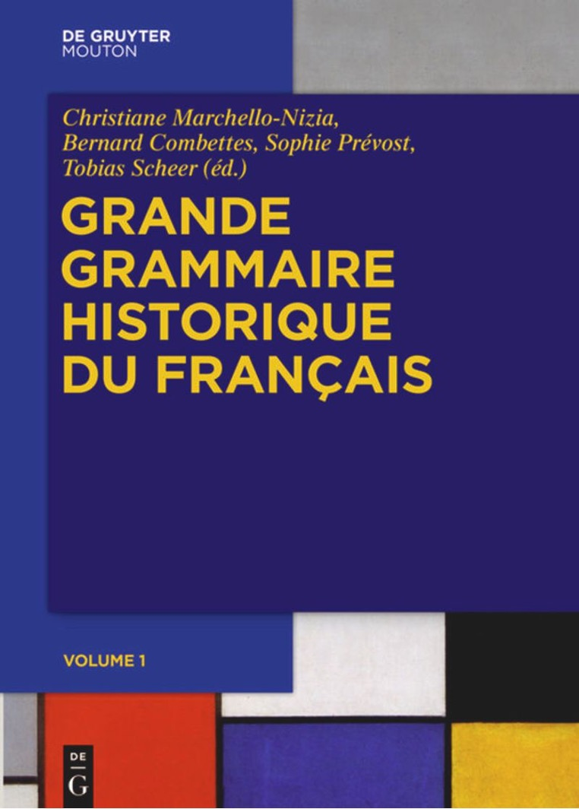

# TXM-Lattice : portail TXM pour explorer et analyser plusieurs corpus de textes. 

## Corpus 

Veuillez consulter les corpus disponibles sur le portail [TXM-Lattice](https://tools.lattice.cnrs.fr/txm/).

### [GGHF : Grande Grammaire Historique du Français](gghf-txm.md)

Le corpus GGHF (corpus de la Grande Grammaire Historique du Français) est un corpus de plus de 13 millions de mots qui couvre la période du 9e au 20e siècle. Les textes qui le composent appartiennent à différents domaines et genres, à des dialectes variés et sont écrits en vers et/ou en prose.

 

####  Métadonnées
- Tableau du corpus GGHF découpé **par périodes** : [cliquez pour visualiser ou télécharger](assets/attachments/CorpusGGHF-Periodes.pdf)
- Tableau du corpus GGHF découpé **par siècles** :  [cliquez pour visualiser ou télécharger](assets/attachments/CorpusGGHF-Siecles.pdf)

#### Documentation

## Liens utiles
- Le [Tutoriel BFM](http://bfm.ens-lyon.fr/spip.php?article297) (qui vous présentera un exemple de session de travail)
- La [Référence rapide CQL pour la BFM](http://bfm.ens-lyon.fr/spip.php?article349) (pour connaître la syntaxe du langage des requêtes)
- Le [Tutoriel vidéo](https://www.youtube.com/watch?v=FaLRLCaKmDw) de l'édition numérique de la Queste del saint Graal
- Le [Manuel de Référence TXM](https://txm.gitpages.huma-num.fr/txm-manual/) en ligne (qui vous présentera tous les outils de TXM)
- Le [site du projet BFM](http://bfm.ens-lyon.fr/) et notamment [sa section documentation](http://bfm.ens-lyon.fr/spip.php?rubrique141)
- Le [site du projet Textométrie](https://txm.gitpages.huma-num.fr/textometrie/)(pour en savoir plus sur la plateforme TXM)
